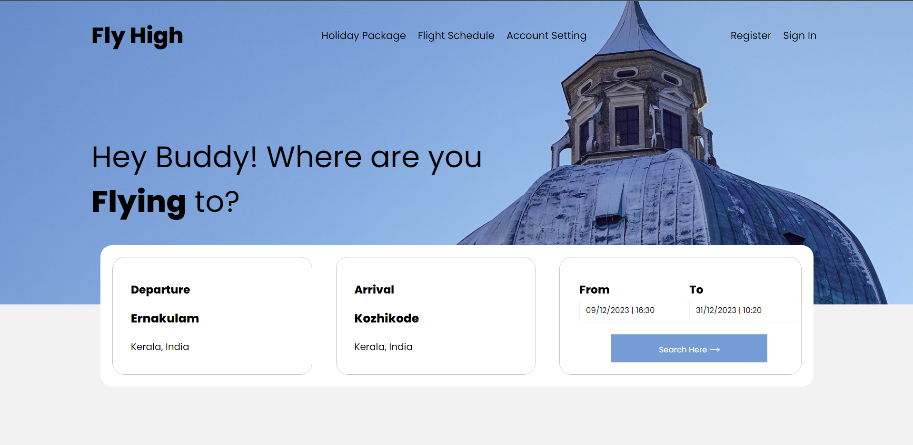

<p align="center">  
<a href="https://github.com/AK08/Fly-High.git">
   
</a>
</p>

# Fly High

Welcome to Fly High, a flight booking web application that aims to make your travel experience seamless and enjoyable.

<p align="center"> 
<a href="https://fly-high-ak9.vercel.app/">View Deployment</a>
</p>

## Table of Contents

- [Introduction](#introduction)
- [Features](#features)
- [Technologies Used](#technologies-used)
- [How to Use](#how-to-use)

## Introduction

Fly High is a user-friendly web application designed to simplify the flight booking process. Whether you're planning a vacation or a business trip, Fly High provides an intuitive interface to help you find, select, and book flights effortlessly.

## Features

- **User-friendly Interface:** Navigate easily through the application with a clean and intuitive design.
- **Customized Travel Experience:** Personalize your travel details to tailor your journey according to your preferences.
- **Real-time Flight Schedules:** Stay informed about flight schedules and any updates to plan your trip efficiently.
- **Account Management:** Create an account to manage bookings, save preferences, and streamline future travel plans.
- **Explore Holiday Packages:** Discover curated holiday packages for exciting travel destinations.

## Technologies Used

- **React:** Powering the dynamic and responsive user interface.
- **CSS:** Styling the application for a visually appealing experience.
- **React Hooks:** Efficient state management for a seamless user experience.
- **GitHub:** Hosted on GitHub for version control and collaborative development.

## How to Use

1. Clone the repository:

   ```bash
   git clone https://github.com/your-username/fly-high.git

2. Navigate to the project directory:

   ```bash
   cd fly-high

3. Install dependencies:

   ```bash
   npm install

4. Run the application:

   ```bash
   npm start


## Additional Features and Improvements (Pending)

While the current version of Fly High provides a robust experience, there are some additional features and improvements that could enhance the user experience further:

1. **Responsive:** Make the website responsive.
1. **Time Selection:** Allow users to specify the departure and return times in addition to dates.

2. **Real-time Clock:** Display the current time in the calendar for better context and user awareness.

3. **Highlight Date Range:** Improve the calendar's visual feedback by highlighting the selected date range:
    - If only the departure date is selected, highlight the corresponding date.
    - If both departure and return dates are selected, highlight all the dates in between.

4. **Interactive Date Selection:** Enhance the date selection process by highlighting the range as the user hovers over dates to choose the return date.

5. **Keyboard Accessibility:** Ensure full accessibility by enabling keyboard navigation for the calendar, making it convenient for users who rely on keyboard controls.

These enhancements aim to make Fly High even more user-friendly, providing a seamless and inclusive travel planning experience.

